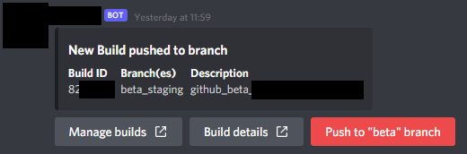

# Steamworks Discord bot

Simple Discord bot to simplify publishing new builds to Steam after they have been uploaded from GitHub CI.

Requires Steam Partner API key and having an app published to Steam, obviously.

## How it works

- GitHub CI uploads build to Steam and sets it live on a non-default branch
- Bot receives GitHub `workflow_run` webhook event and fetches data from Steamworks API
  + Additionally, updates are fetched every <N> minutes to catch updates that did not trigger a webhook (e.g. uploads outside of CI)
- Bot publishes build update to Discord, including Discord component button to set build live
  + A mapping of branches can be defined in the config (e.g. `staging` -> `default`, `beta_staging` -> `beta`, etc.)
- If a user with the necessary role hits the button, the build is set live on the corresponding branch via the Steamworks API
